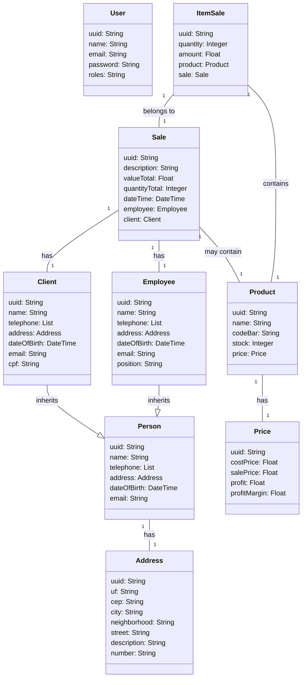

# 🚀 **Store - Spring Boot**

## 📝 **Descrição**

Este projeto é uma aplicação robusta de **loja** (Store) desenvolvida utilizando o poderoso framework **Spring Boot**, com o objetivo de gerenciar de forma eficiente produtos, vendas, clientes e funcionários. A aplicação segue as mais **exigentes boas práticas** de arquitetura e princípios de desenvolvimento, como o **padrão MVC** e **SOLID**, garantindo uma **escabilidade**, **segurança** e **qualidade** excepcionais no código.

Com o uso das melhores ferramentas da atualidade, o sistema foi pensado para **desempenho** e **manutenibilidade** ao longo do tempo.

## 🔥 **Diagrama de Classes**

Aqui está o diagrama que representa a estrutura de classes do sistema, suas inter-relações e hierarquias:




## ⚙️ **Tecnologias Utilizadas**

Este projeto utiliza uma combinação de tecnologias modernas que garantem robustez, escalabilidade e facilidade de manutenção. Confira as principais ferramentas e frameworks que impulsionam a aplicação:

| **Tecnologia**        | **Descrição**                                                       |
|-----------------------|---------------------------------------------------------------------|
| **Spring Boot**        | Framework poderoso e simplificado para a construção de APIs.       |
| **Dockerfile**         | Arquivo de configuração para criação de imagens Docker de forma prática e eficiente. |
| **Docker Compose**     | Ferramenta para orquestrar múltiplos containers Docker, facilitando o gerenciamento do ambiente. |
| **Padrão MVC**         | Arquitetura que separa as responsabilidades, tornando o código mais organizado e fácil de manter. |
| **SOLID**              | Princípios de design que garantem código modular, escalável e de fácil manutenção. |
| **JPA**                | API que facilita a persistência de dados em bancos relacionais.     |
| **Validation**         | Ferramenta para validação de dados de entrada, garantindo consistência e segurança. |
| **PostgreSQL**         | Banco de dados relacional robusto e altamente confiável para armazenar dados de forma eficiente. |
| **H2 Database**        | Banco de dados em memória, ideal para desenvolvimento rápido e testes. |
| **Swagger**            | Documentação interativa da API que facilita o consumo e entendimento dos endpoints. |
| **Java 21**            | A versão mais recente do Java, que traz novas funcionalidades e otimizações. |
| **JUnit**              | Framework para testes automatizados, essencial para garantir a qualidade e a confiabilidade do código. |
| **Autenticação Básica**| Mecanismo simples para garantir que apenas usuários autenticados possam acessar a aplicação. |
| **JWT**                | Tokens de autenticação que garantem a segurança na troca de informações entre o cliente e o servidor. |
| **Handler de Exceções**| Sistema centralizado para tratar erros de forma eficiente e clara para o usuário. |

## 🏗️ **Estrutura do Projeto**

A estrutura do projeto segue a arquitetura limpa e escalável, organizada da seguinte forma:

- **Controller**: Gerencia as requisições HTTP e a lógica de interação com o cliente.
- **Service**: Contém a lógica de negócios da aplicação.
- **Repository**: Responsável pela comunicação com o banco de dados.
- **Model**: Contém as entidades que representam os dados da aplicação.
- **Exception Handling**: Módulo centralizado para tratar exceções de maneira eficaz.
- **DTOs**: Objetos de transferência de dados usados para comunicação entre as camadas e para validação de entrada/saída.

## Como Executar

1. Clone o repositório:

   ```bash
   git clone https://github.com/usuario/projeto-store.git
   ```
   
2. Navegue até o diretório do projeto:
   
   ```bash
   cd projeto-store
   ```

3. Certifique-se de ter o Java 21 e o Docker instalados na sua máquina.

4. Compilar o Projeto: Se você estiver utilizando o Maven ou Gradle, basta rodar o comando para compilar o projeto e resolver as dependências:

## Para Maven:

  ```bash
  mvn clean install
```
## Para Gradle:

  ```bash
./gradlew build
```

5. Executar o Projeto Localmente: Para rodar o projeto em um ambiente local, você pode executar o comando:

## Para Maven:

  ```bash
  mvn spring-boot:run
```

## Para Gradle:

  ```bash
  ./gradlew bootRun
```

O aplicativo será iniciado na URL padrão http://localhost:8080.

6. Executando com Docker: Você também pode rodar a aplicação utilizando Docker. Para isso, siga os passos abaixo:

- Criação da Imagem Docker: No diretório do projeto, execute o comando para criar a imagem Docker:

  ```bash
  docker build -t store-app .
  ```
  
- Subir os Containers com Docker Compose: Utilize o Docker Compose para subir os containers, incluindo o banco de dados PostgreSQL e a aplicação Spring Boot:

  ```bash
  docker-compose up
  ```
  
Isso irá subir a aplicação na URL http://localhost:8080.

7. Acessando a Documentação Swagger: Após iniciar o projeto, você pode acessar a documentação da API em tempo real através do Swagger em:

  ```bash
  http://localhost:8080/swagger-ui.html
  ```
